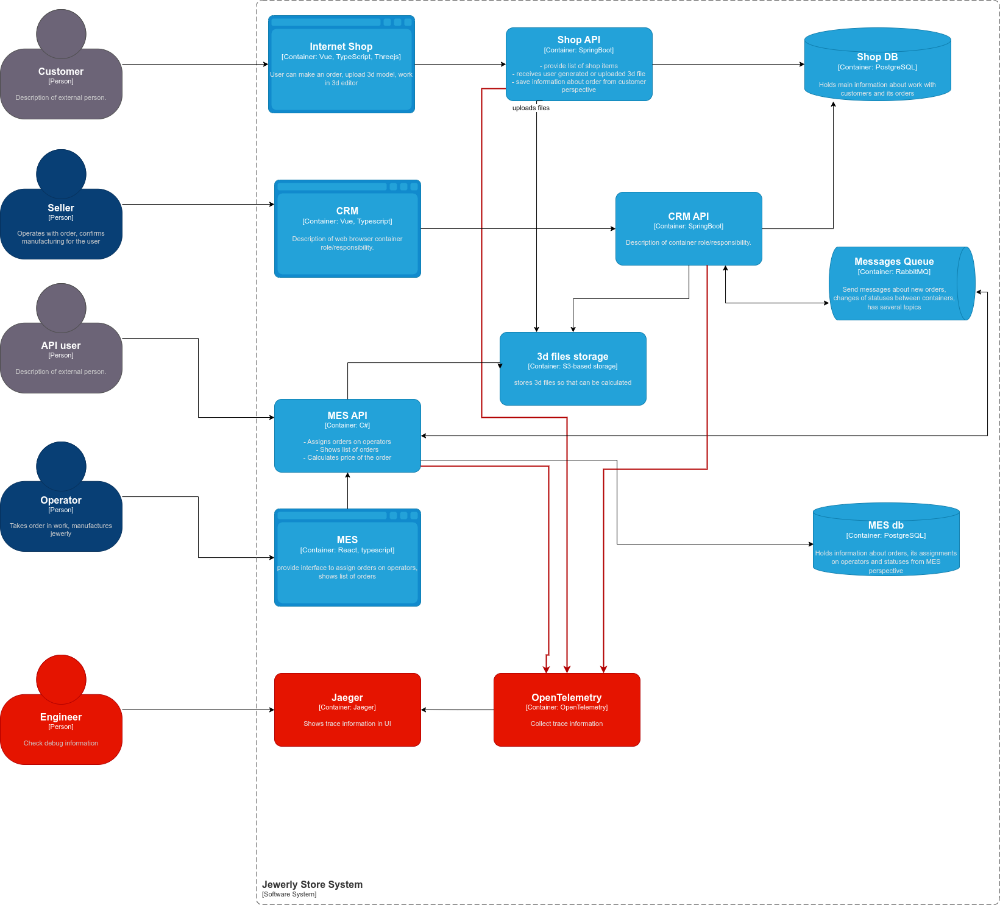

# Архитектурное решение по трейсингу

## Анализ
Заказы часто находятся в непонятном состоянии. Распределенная система выглядит как блек бокс. После отправки сообщения мы не имеем информации о том, что сейчас с запросом и где он.

## Мотивация
Нужно отследить путь заказа Shop -> CRM -> Mes и понять где запрос теряется. 
При возникновении инцидента важно быстро локализовать и расследовать проблему, в этом нам поможет трейсинг. 
Можно отслеживать в каком сервисе сколько задержался запрос, и, например, оптимизировать какие-то части. Можно внедрить паттерн отказоустойчивости deadline и придумать фоллауты если сервис задержал сообщение.
Также можно добавить метрику сколько заказов потеряно и постепенно её улучшать.

## Предлагаемое решение
Подключить Opentelemetry в Shop Api, Crm Api, Mes Api.
Развернуть Jaeger в режиме all-on-one + agent + collector для экспорта.
При входящем запросе мы создаем trace_id и добавляем в заголовки http и сообщение rabbitmq
Далее в сервисах куда пришел запрос вытаскиваем trace_id и создаем span_id для своих операций.

## Компромиссы
При большом числе заказов объем трейсов может сильно распухнуть, поэтому можно трассировать только часть запросов или включать трейсинг по тумблеру.
В RabbitMq нужно будет ручками закодировать нужные нам заголовки.
Так как Mes Api это закрытый код на C#, то потребуется время на интеграцию.
В дальнейшем нужно изменить режим all-in-one для продакшена на агент + коллектор, а текущую схему оставить для дев стенда.

## Аспекты безопасности
Развернем впн для ограниченного доступа к Jaeger. 
Также подключим oauth через keycloak, доступ будет по рабочим почтам.
Чувствительные данные не должны попадать в span_id.
Обеспечить tls соединение (зашифрованное)