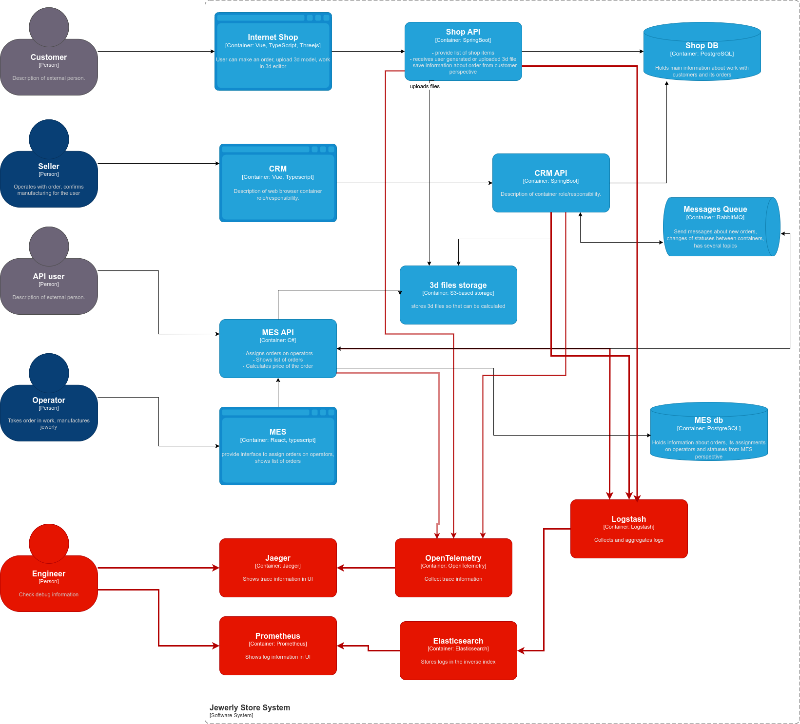

# Архитектурное решение по логированию

## Анализ
Сбор логов будет осуществляться из следующих сервисов:
1) Shop Api - пишем в filebeat/logstash
2) Crm Api - аналогично
3) Mes Api - аналогично
4) Rabbit Mq - логи о работе брокера

Необходимые логи уровня INFO
1) Создание нового заказа
2) Оператор взял заказ в работу
3) Оператор закончил работу
4) Публикация сообщений в RabbitMq
5) Изменение статуса заказа

Используемые уровни логирования
1) INFO - стандартные события, которые нельзя отследить по другому
2) WARN - нестандартные ситуации, потенциально ошибочные места
3) ERROR - ошибки
4) Для dev окружения DEBUG, TRACE - отслеживание дополнительных деталей

## Мотивация
Основная мотивация добавления логирования - уменьшение времени расследования инцидента. Если во время деградации сервисов мы быстро по логам найдем первопричину, это значительно снизит время на устроение ошибки. В другом сценарии нам пришлось бы воспроизводить эту ситуацию по информации с прода.
Также можно собирать метрики о количестве варнов, ошибок, можно выявлять нестандартное поведение и превентивно чинить.
Дадим доступ к логам службе поддержки, чтобы она могла перед созданием баг кейса самостоятельно исследовать логи и искать причины, снимая эту задачу с разработчиков.

## Предлагаемое решение
Разворачиваем ELK стек. Алгоритм работы:
1) Сервисы пишут логи в файлы
2) Logstash читает файл, делает агрегацию и через bulk заливает логи в индекс эластика
3) Индекс мы создаем для каждого сервиса свой
4) В Index Lifecycle Management указываем, что логи с ошибками должны жить дольше, чем логи уровня INFO
5) Весь стек мы деплоим под впн, чтобы избежать несанкционированного доступа
6) Настраиваем алертинг, если приходит очень много логов с ошибками

