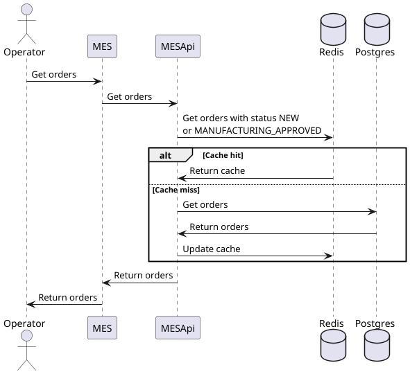
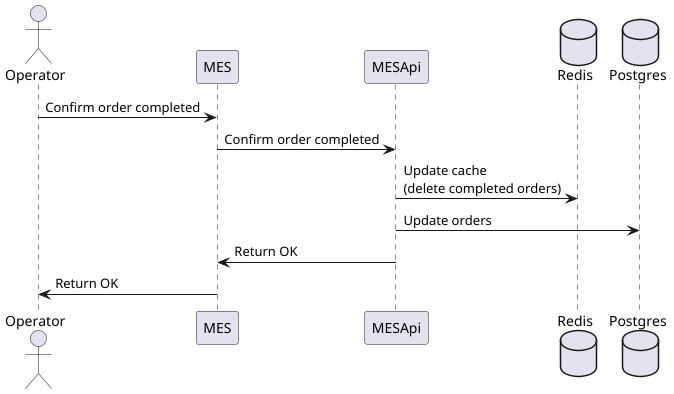

# Архитектурное решение по кешированию

## Анализ
Операторы жалуются что MES долго отображает страницу с заказами. Вероятно, там под капотом большой sql скрипт, выполнение которого заставляет оператора ждать. При повторном обновлении страницы могут возникать параллельные транзакции, что еще сильнее замедлит работу БД. Здесь имеет смысл закешировать заказы и при обновлении настроить корректную инвалидацию кеша.
Недовольство клиентов как раз связано со сложностью отображения страницы с заказами для оператора.

## Мотивация
Операторы будут быстро получать заказы, сдавать работу в срок. Пользователи будут счастливы.
Снимаем нагрузку с БД.  

## Предлагаемое решение
Разворачиваем redis cluster и будем реализовывать серверное кеширование.
Будем использовать следующие паттерны:
1) Cache Aside - сначала смотрим в кеш, если есть, то возвращаем его, если нет, то идем в БД и на обратном пути заливаем в кеш.
2) Refresh Ahead - по истечению срока жизни кеша сами идем в БД и обновляем кеш
3) Write-Through - при апдейте заказа мы синхронно сначала добавляем данные в кеш, а потом идем сохранять в БД

Инвалидация кеша будет происходить по ключу. Можем взять айдишник заказа.

## Сиквенс диаграммы

Запись

Чтение
